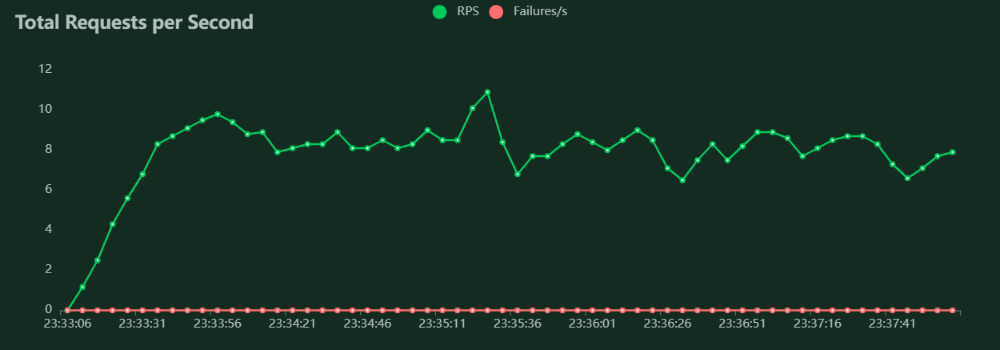
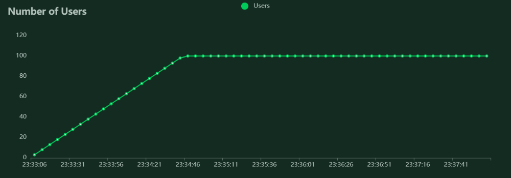
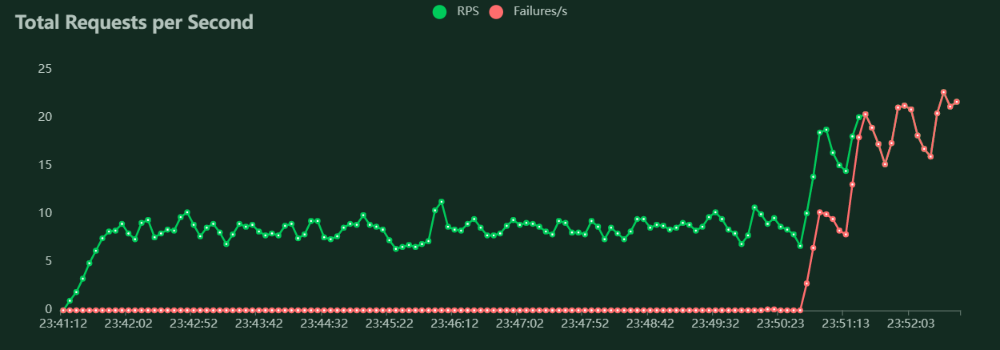
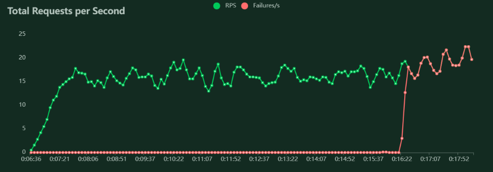
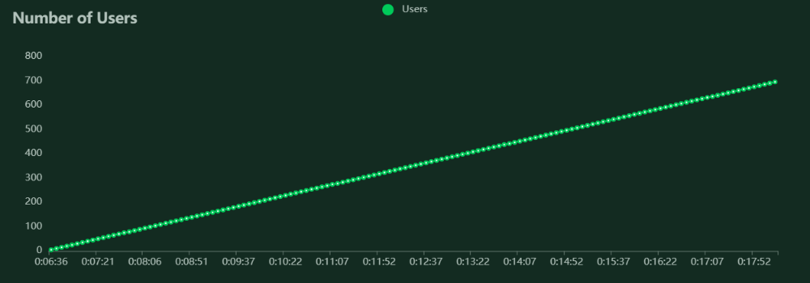

# Stress test using Locust

## Computer characteristics
Processor:	AMD Ryzen 7 4700U with Radeon Graphics 2.00 GHz.

RAM: 16,0 GB (15,4 GB usable).

Operative System 64 bits.

##
## Configuration: users=10, num_of_model_process=1

We used just one model process for prediction.

_10u_1p.png)

## Configuration: users=100, num_of_model_process=1
We can see that the response time increases but the system works without errors.

_100u_1p.png)

## Configuration: users=1000, num_of_model_process=1
The system continued to function correctly until 568 users arrived, then it started to have errors handling requests. 

_1000u_1p.png)

## Configuration: users=1000, num_of_model_process=2
When we add a prediction process, we can see that the system increases the number of requests per second it can handle, and the response time decreases by half. In addition, the system was able to handle up to 587 users without breaking down.  

_1000u_2p.png)

